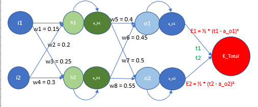

# BackPropogation

This is the Network for which we are writing the backpropgation.

First step comes in the forward pass.

Here we have the input values i1 and i2 as 0.05 and 0.1 respectively and target values in t1 and t2 as 0.5 each. We have initialized the weights w1, w2, w3, w4, w5, w6, w7 & w8 as 0.15,0.2,0.25,0.3,0.4,0.45,0.5 & 0.55 respectively. 

Now using the formulea we calculate the values of all the varibles which are a_h1, a_h2, o1, o2, a_o1, a_o2 and then we calculate the error E1 and E2. With these error we calculate the total error.

Now is the time to Back propogate and update the weights. Here we need to update the weights, therefore we partially differentiate using these weight varibles.

here is an example how it is done for w5.

Here we differentiate Error total with w5, as error total is made up of E1 and E2, and E2 doesnt have w5, therefore on differentiating, E2 becomes 0 and E1 is retained. Now we put in the values for E1, i.e. how it is calculated. Thus here we apply chain rule and differntiate.

Therefore we get the following values. 

Now to get w1,w2,w3 and w4. We propogate backwards, calcauting eht partial differntiataion of E total with a_h1 and a_h2. 

Thus we apply chain rule here as well. 

Thus we calcuate the partial differntiation.

Once we have the values we update the weights by substracting it with the differntiated value times learning rate in order to minimize the lose. 

We therefore have simulated these process of backpropogation. 

 

 Result excel is [Here](BackPropagationManual.xlsx).

 Once we start increasing the learning rate, we see that the model converges faster. this happens to a point beyond which model is not learning. Therefore is the LR is too low it will converege very slow, if it is too high it will never converge. 

 Learning Rate - 0.1

 
 
 Learning Rate - 0.2

 
 
  Learning Rate - 0.5

 
 
  Learning Rate - 0.8

 
  
  Learning Rate - 1

 

 Learning Rate - 2

 

 Learning Rate - 10

 

Learning Rate - 1000

